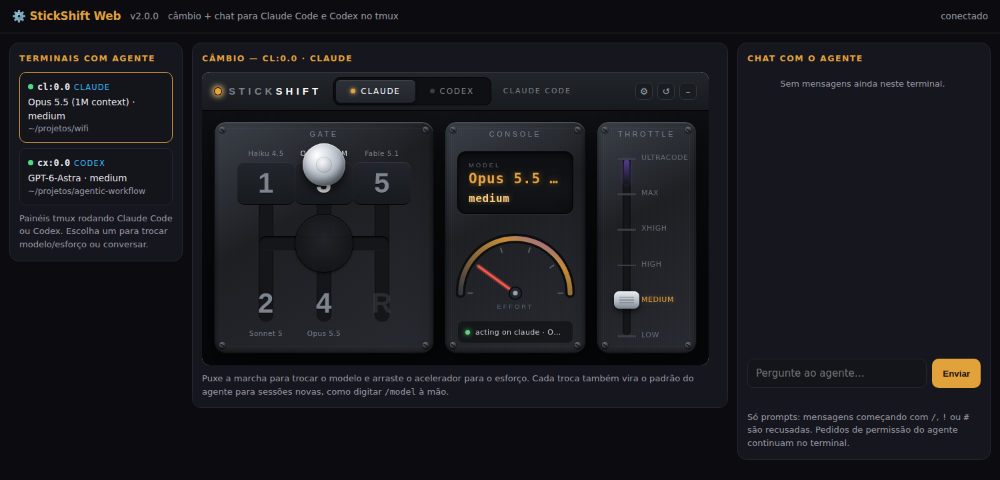

# StickShift v2: Linux e WSL, com painel web e chat

A versão do StickShift para **Linux e Windows via WSL**. Ela troca o modelo e o esforço do **Claude Code** e do **Codex** que rodam em painéis do **tmux**, pela linha de comando ou por um **painel web**. O painel tem o mesmo câmbio do app de macOS e um **chat nível 1**, que manda prompts para o agente do painel escolhido.

Usa só Python 3 e a biblioteca padrão. Não há `pip install` nem build.



## Uso

```sh
# no PATH (uma vez)
ln -s "$PWD/v2/bin/stickshift2" ~/.local/bin/stickshift2

stickshift2 list                              # painéis tmux com Claude Code / Codex e o estado de cada um
stickshift2 status --pane %3                  # um painel em detalhe
stickshift2 shift 4 --pane %3                 # simulação: mostra o plano, não digita nada
stickshift2 shift 4 --pane %3 --commit        # troca de verdade
stickshift2 shift opus[1m]:high --commit      # modelo:esforço direto (painel atual do tmux)
stickshift2 chat "resuma o README" --pane %3  # chat nível 1 pela linha de comando
stickshift2 web                               # painel web em http://127.0.0.1:8765/?t=<token>
stickshift2 keys                              # linhas bind-key para ~/.tmux.conf
```

`--pane` aceita o id do tmux (`%3`) ou `sessão:janela.painel`. Sem `--pane`, o alvo é o painel que o cliente tmux atual está mostrando.

## Marchas padrão

| Marcha | Claude Code | Codex |
|---|---|---|
| 1 | Haiku 4.5 | gpt-6-luna · medium |
| 2 | Sonnet 5 | gpt-6-sol · medium |
| **3** | **Opus 5.5 (1M) · medium** | **gpt-6-astra · medium** |
| 4 | Opus 5.5 (1M) · high | gpt-6-astra · high |
| 5 | Opus 5.5 (1M) · xhigh | gpt-6-astra · xhigh |
| R | Opus 5.5 (1M) · low | gpt-6-sol · low |
| ULTRA | Opus 5.5 (1M) · ultracode | gpt-6-astra · ultra |

A escada segue a referência de esforço em [inematds/modelos](https://inematds.github.io/modelos/guia/esforco/).

**`opus` e `opus[1m]` são modelos diferentes.** `/model opus` define "Opus 5.5" com 200K de contexto; `/model opus[1m]` define "Opus 5.5 (1M context)". As marchas usam `opus[1m]`.

Tudo se configura em `~/.stickshift/config.toml`, o mesmo arquivo do app de macOS:

```toml
gear.3.claude = "sonnet high"
claude_model.mythos = "Mythos 1"                         # modelo novo: token = nome na confirmação "Set model to …"
codex_model.gpt-7-nova = "low medium high xhigh max"     # modelo novo do Codex e os esforços que ele aceita
dialog_policy = "confirm"                                # responder o "Switch model?" do Claude
auto_answer = true
```

## Garantias (fail-closed)

- **O agente é identificado pelo processo**, não pelo texto da tela: o processo em primeiro plano do painel (`/proc`) precisa ser o binário do Claude Code (`…/claude/versions/<v>`) ou o `codex.js`/binário do Codex. No Linux não há assinatura de código como no macOS; a identidade fica no local de instalação + versão.
- **Só digita com o agente ocioso, o campo de texto na tela e vazio.** O texto-fantasma (sugestão do Claude, exemplos do Codex) é reconhecido pelo atributo *dim*, e não conta como rascunho.
- **Entrega provada** (o comando aparece na tela antes do Enter) e **verificação pela confirmação do próprio agente** ("Set model to …", "Set effort level to …", "Model changed to …"), contada contra o que já havia antes. A linha de status não é necessária.
- Recusa com código de motivo: `NO_AGENT`, `BUSY`, `DRAFT_PRESENT`, `AGENT_WAITING`, `UNSUPPORTED_EFFORT`, `SELF_TARGET`, `LOCKED`…
- **Cada troca também vira o padrão do agente para sessões novas**, igual a digitar `/model` à mão: o Claude grava em `~/.claude/settings.json` e o Codex em `~/.codex/config.toml`. O Ultra do Codex vale só para a conversa atual. Se você roda bots que dependem do padrão, leve isso em conta.

## Painel web

- Só em `127.0.0.1` por padrão. `--remote` escuta em todas as interfaces (use com Tailscale).
- **Token obrigatório em toda chamada**, inclusive leituras. O endereço com o token é impresso ao iniciar.
- Checagem de `Host` (contra DNS rebinding) e de `Origin`; nenhum cabeçalho CORS.
- Tudo o que é enviado vai para `~/.stickshift/v2.log` (permissão 0600).

### Chat nível 1

- Manda **prompts** para o agente do painel escolhido e mostra a resposta lida da tela, com histórico por painel.
- Mensagens começando com `/` (comandos), `!` (shell) ou `#` (memória do Claude) são recusadas, assim como quebras de linha e caracteres de controle.
- Tarefas no sistema passam pelo agente e pelas permissões dele; o chat nunca roda comando de shell.
- Pedidos de permissão do agente **não** são respondidos pelo chat, que avisa que o agente espera no terminal. Aprovar pelo chat é a v3.

## Testes

```sh
cd v2 && python3 -m unittest discover -s tests -v
```

São 24 testes, com telas reais anonimizadas: catálogo, classificador, planos, chat, configuração e guardas do servidor web. A validação ao vivo foi feita em 24/09/2026 num tmux isolado (`-L sstest`), com Claude Code 2.1.282 e Codex 0.156.1:
- trocas de modelo e esforço nos dois agentes;
- Ultra pelo submenu "More reasoning…";
- recusas;
- chat pela linha de comando e pelo painel web.

## Limites

- **Só tmux por enquanto.** O backend WezTerm, que cobre o Windows nativo, é a fase 5 do plano: ainda não existe e precisa de uma máquina Windows para testar.
- **As telas mudam entre versões.** O Codex 0.156.1 mudou o rodapé, o seletor de esforço e o símbolo do campo no Ultra (`»`). Ao atualizar um agente, rode `stickshift2 status` e uma simulação antes de confiar.
- **As respostas do chat são lidas da tela.** Respostas muito longas podem vir cortadas; veja no terminal.
